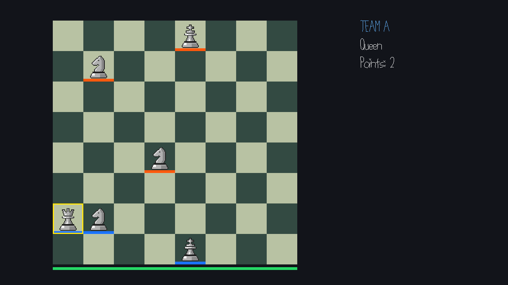

# Multiplayer Chess

- **Author**: Yuchen Zhou
- **Description**: Chess without turns. Control one piece, capture opponents, and protect your wandering king (he is drunk!).



# Asset Pipeline

The six chess pieces have editable `.aseprite` sources and exported PNGs in [`assets/`](assets/). Export changes to the matching PNG, then build: `Maekfile.js` copies the images into `dist/`, and the client loads them as textures. The board and team markers are drawn in code.

# Networking

The **server controls the rules**, including movement, captures, timers, king AI (not an actual AI tho), and scores. Clients send move (`m`) or piece-selection (`p`) requests over TCP; the server broadcasts snapshots (`s`) at 30 Hz.

[`ChessLogic.cpp`](ChessLogic.cpp) implements the rules, [`Game.cpp`](Game.cpp) handles messages, and [`PlayMode.cpp`](PlayMode.cpp) handles input and drawing. Life and round IDs reject outdated requests.

# How To Play

1. Start as a **knight with 0 points**. Your piece has a yellow outline. Blue is Team A and orange is Team B.
2. **Left-click a destination** to move or capture. Knights jump in an L shape. Other pieces use normal chess movement, without special moves or check/checkmate.
3. Everyone moves in real time. The bar below the board shows your **one-second movement cooldown**. Both kings move automatically, like a durnk one.
4. Captured? **Respawn after three seconds**, keeping your piece and points. A full home area will delay spawning.
5. **Capture the enemy king to win.** During the five-second break, its capturer can buy one piece by clicking the menu or pressing **1–5** for pawn, knight, bishop, rook, or queen. **0 or no choice keeps your current piece free.**
6. Capture rewards and purchase prices: **pawn 1, knight/bishop 3, rook 5, queen 9**. Capturing a king earns **5 points**. Points and piece types carry into the next round.

# Build and Run

Set up the course libraries using [NEST.md](NEST.md), then build and start a server:

```sh
node Maekfile.js
./dist/server 12345
```

Start each player in a separate terminal:

```sh
./dist/client localhost 12345
```

For another computer, replace `localhost` with the server's address.

# Notes

This game was built with [NEST](NEST.md).
